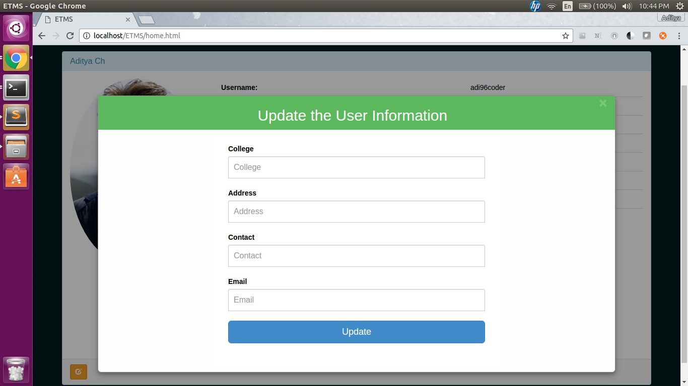

# ETMS
ETMS (Expenses and To-do Management System) is a web application developed using HTML, CSS, JavaScript, PHP and MySQL. No backend framework has been used. Everything was coded from scratch. This was made to demonstrate my full stack programming skills using LAMP (Linux-Apache-MySQL-PHP).

<h2>Features</h2>
<ul>
  <li>ETMS can maintain your To-Do list</li>
  <li>It can keep track of your expenses</li>
  <li>It generates a graph using which you can visualize the amount you are spending over time</li>
  <li>Lastly, it also maintains your profile information</li>
</ul>

<h2>Running the Project</h2>
It is recommended to run this application in any Linux environemnt (Preferably Ubuntu, since this procedure is documented considering the environment as Ubuntu-16.04)
<ul>
  <li>Make sure you have Apache, PHP, and MySQL installed</li>
  <li>Enable php scripts to run in .html files (By default this switch is turned off)</li>
  <li>Turn on the following options in php.ini file: <i>fileUploads, session.use_cookies, session.cookie_httponly, session.use_strict_mode (Once you get the SSL certificate for using 'https' turn on session.cookie_secure as well)</i></li>
  <li>Create a database called etms_db in MySQL and use db_init.sql file to load the required back-end tables (along with some dummy data so that once your application starts you have some data to show)</li>
  <li>Clone the project into <i>/var/www/html/</i> directory</li>
  <li>Start your apache server. If it is already running then restart it (so that the changes which you've made get reflected)</li>
  <li>The project is now up and running. You can access it at: <a href="locahost/ETMS">locahost/ETMS</a>. If your apache server is not running on the default port(Port-80), then it can be accessed at localhost:&lt;apache-port&gt;/ETMS</li>
</ul>
If you find any problem deploying the project in your machine, please do let me know.

<h2>Technical Skills</h2>
This project is developed to showcase my following programming abilities:
<ul>
  <li><h3>Security aspects in PHP</h3>
The project contains form-validations for almost every input at client side. Back-end validations are done in PHP. However, few PHP file's still require the validations on input data. Form-validation's prevent attacks on the website such as SQL Injection, Cross Site Scripting (XSS), etc.

In order to prevent <i>Source Code Revelation</i> when apache goes down in an event of failure, move the <i>constants.js</i> file and <i>constants.php</i> file out of the document root folder. This makes those files inaccessible to the client. The risk of <i>Session Hijacking</i> is reduced considerably by storing the PHPSESSID in the cookie, rather than passing it as a parameter in the URL. Also, as mentioned in the <i>'Running the Project'</i> section, php.ini file is configured to make the cookies accessible only via HTTP (i.e. using JavaScript the client cannot access the cookies.)

Once the SSL certificate is generated for this website we can turn on the 'session.cookie_secure' option as well thereby making it hard for the attacker to gain access to the cookie by packet-sniffing (since the data gets encrypted when we use <i>'https'</i>). Lastly the number of incorrect attempts for logging-in and signing-up are set to a constant <i>5</i>. This is done to save the website from DoS(Denial-of-Serivce) attack. It is not the correct method, but yes, it does reduce the load on the server (otherwise every incorrect operation makes a call to the database to check whether the user_name and password are right)
</li>
  <li><h3>Data structures using PHP</h3>
Bloom filters have been used for 2 functionalities: To check for the user_name as well as to check for the email_address in the database. Ideally, if we think about the project on a large scale, for checking whether a user_name is valid or not, the input user_name must be compared to all the user's in the database who are already registered. This makes the operation super-expensive. Keeping this in mind, Bloom filters have been used. See the comments in <i>databaseQueries.php</i> file to understand more about it.
</li><li><h3>REST Service</h3>
The project can also be consumed in any third-party application as REST Service. TO DO
</li>
  <li><h3>Basic Web development skills:</h3>
No framework has been used in developing this project. Everything is coded from scratch. Be it HTML, CSS, JS, and PHP. However, for the UI, Bootstrap and FusionChartsLibrary has been used.
</li>
  <li><h3>Good looking UI</h3>
Last but not the least, the project has been developed keeing in mind Beautiful web-pages
</li>
</ul>

<h2>Development</h2>
<ul>
  <li>Sublimt Text has been used to code HTML, CSS, JavaScript, and JS. No IDE has been used</li>
  <li>Command line has been used in interacting with MySQL database</li>
  <li>The project has been tested on Google Chrome. Some features <i>'might'</i> fail or atleast not function as expected in other browsers. Cross-browser development was never this project's goal and hence you <i>'may'</i> expect some problems if your favorite browser is not Chrome.</li>
  <li>Almost every file is descriptive in nature. Comments provide in-depth explanation about what's going on. Do have a look at the code. It's well crafted</li>
  <li>Good, if not best, coding standards have been followed in developing the project. For instance, constants used in the project have been all accumulated in a single file (<i>constants.js</i> and <i>constants.php</i>). You will get to know once you have a look at the directory structure</li>
</ul>

<h2>Screenshots</h2>

<h4>The login page</h4>

<h4>The Signup page</h4>

<h4>The Home page</h4>

<h4>The Expenses page</h4>

<h4>List of expenses</h4>

<h4>The TO-DO page</h4>

<h4>List of Todo's</h4>

<h4>Graphical representation page</h4>

<h4>Profile page</h4>

<h4>Update pop-up</h4>

  
Use this, report bugs, raise issues and Have fun. Do whatever you want! I would love to hear your feedback :)

~ Happy Coding
